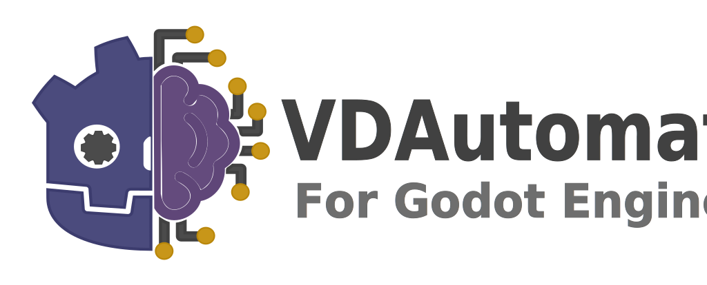

# (WIP) VDAutomata

    

A Godot Engine module for native automation.

**ATTENTION:** this module is heavily under development and current implementations may change at a later point. Open an [issues](https://github.com/VoiDjinn/vdautomata/issues) to report any problem. If you need any help, open a new [discussion](hhttps://github.com/VoiDjinn/vdautomata/discussions).

### Tested Godot version
The module is built with version 3.4+ in mind.

## What is this module for?
VDAutomata aims to provide native components for creating state and behaviour management systems.

## Status (WIP)
### Steering AI (SAI)
- [x] default states (partially)
### State Machine (Pushdown + Hierarchical State Machine)
- [x] Hierarchical States
- [ ] State History
### Behaviour Tree
- [ ] ...
### Goal Oriented Action Planning (GOAP)
- [ ] ...

## Documentation
The [Wiki](https://github.com/VoiDjinn/vdautomata/wiki/) is available:
- [Glossary](https://github.com/VoiDjinn/vdautomata/wiki/Glossary)
- [Setup](https://github.com/VoiDjinn/vdautomata/wiki/Setup).
